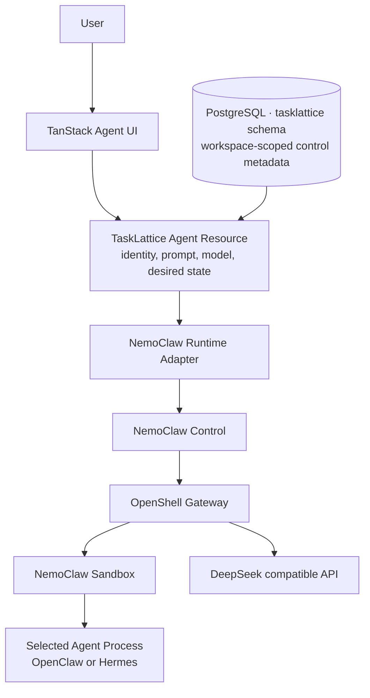
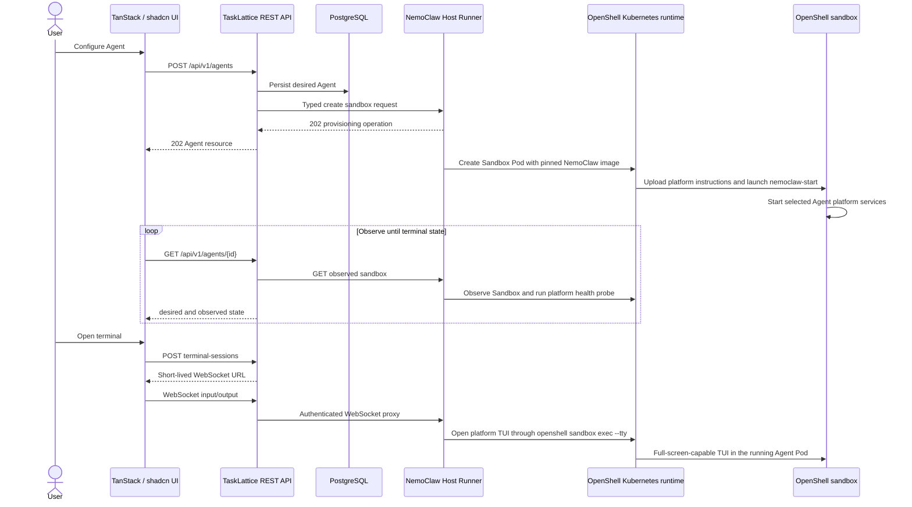

# TaskLattice NemoClaw Agent Core Flow

Status: Implemented vertical slice

Version: 0.2

## Current outcome

The supported user outcome is:

> Configure a NemoClaw Agent using DeepSeek, instantiate its OpenShell sandbox, observe it until ready, and then open an interactive terminal into that sandbox.

Everything else in the historical marketplace design is later scope. The UI keeps those destinations visible for information architecture continuity but renders them disabled and grey.

## Agent resource and runtime boundary

The Agent is a first-class TaskLattice resource. It is not the sandbox itself: TaskLattice persists the desired Agent identity, platform, and configuration, then projects that resource into one NemoClaw sandbox containing the selected OpenClaw or Hermes Agent process.



## Interaction flow



## Frontend organization

The web application uses:

- TanStack Router file routes for Overview, Agent list, Create Agent, and Agent detail;
- TanStack Query for Agent list/detail server state and provisioning polling;
- TanStack Form for the typed create form;
- shadcn/ui source components for buttons, cards, fields, selects, badges, progress, skeletons, and tooltips;
- xterm.js with FitAddon for terminal rendering.

Active UI actions:

- Create Agent.
- Open Agent instance.
- Open terminal after the sandbox is `READY`.

Visible but disabled actions:

- Service catalog and quota.
- Skills.
- Approvals.
- Usage and cost.
- Platform settings.
- Global search and credential management.

Disabled actions use native `disabled` behavior, reduced contrast, a not-allowed pointer, and explanatory tooltips. They do not issue requests.

## Agent creation contract

```json
{
  "name": "research-assistant",
  "description": "Internal research assistant",
  "runtime": "nemoclaw",
  "agentPlatform": "openclaw",
  "modelDeploymentId": "validated-model-id",
  "policyId": "unrestricted",
  "systemPrompt": "You are a focused internal assistant..."
}
```

The API rejects any runtime other than `nemoclaw` and any Agent platform outside
`openclaw` and `hermes`. Agent creation accepts only a validated LLM deployment
registered under a validated Provider Account. OpenClaw remains the default
when older clients omit `agentPlatform`.

The REST response is the durable Agent resource, not raw NemoClaw CLI output. Desired configuration and observed runtime fields are separate.

During creation, the runner uploads the submitted instruction section to the
selected platform's workspace before starting `nemoclaw-start`. READY is
published only after that platform's health endpoint responds.

## Provider and cost boundary

Provider Accounts group Provider-specific configuration and opaque credentials with multiple categorized model deployments. Registration first discovers remote or recommended models without persistence, always permits a manual model ID, and revalidates the connection before committing selected models through LiteLLM. At least one model must pass the final capability probe; partial success retains only healthy models and reports failures per model. LiteLLM issues a model-scoped key per Instance and attributes spend through Provider Account metadata; the public API never returns Provider or Instance credentials. Startup does not create Provider data, so local and deployed environments use the same registration path.

OpenShell built-in Policies are deployment configuration. The Helm chart stores the catalog in a ConfigMap, the control Pod mounts it read-only, and the API exposes those entries as immutable. The catalog default is `unrestricted`, which allows arbitrary shell and file operations in Sandbox-owned writable paths and includes `/dev/null`; OpenShell still disallows root execution and undeclared global network egress.

## REST and terminal protocols

All resource operations use versioned REST endpoints. `POST /agents` returns `202 Accepted` because onboarding may build images and take minutes. `GET /agents/{id}` reconciles observed state. `DELETE /agents/{id}` destroys the NemoClaw sandbox and then removes the control-plane resource. The complete OpenAPI 3.1 contract is available at `/api/v1/openapi.json` for third-party UIs.

Terminal sessions are created through REST, expire after five minutes if unused,
and are single-use. Following the proven Volcano Dashboard terminal flow, the
WebSocket transports raw terminal text in both directions. The server emits a
`Connected to ...` line only after the OpenShell PTY has been allocated. The
frontend buffers output, sends bounded resize control frames, distinguishes the
fixture shell from the NemoClaw TUI, and keeps a session alive briefly across
React remounts. A connected PTY is not reported as TUI-ready until its first
interactive frame arrives.

The browser never connects directly to a Runtime Host and never receives the shared runner credential.

## Kubernetes and NemoClaw boundary

Kubernetes runs the stateless web/API process and provides persistent storage for control-plane resources. The control Pod has no Kubernetes API token or RBAC permissions.

The TaskLattice runner is an unprivileged Kubernetes workload without a Docker socket
or Kubernetes ServiceAccount token. It calls the OpenShell gateway, whose
Kubernetes driver creates the Agent Sandbox resource, Pod, and PVC. NemoClaw's
Docker-oriented host lifecycle is deliberately not run inside the cluster;
only the official in-sandbox runtime is reused.

## Validation semantics

Fixture mode proves:

- Agent REST creation, persistence, list, and observation;
- asynchronous `PROVISIONING -> READY` behavior;
- typed control API to runner calls;
- terminal-session authorization and single-use URL;
- WebSocket proxying and bidirectional terminal bytes.

Fixture mode does not prove that NemoClaw or DeepSeek ran. Kubernetes acceptance
uses `TALI_EXPECT_NEMOCLAW_RUNTIME=1` and additionally proves the pinned
`nemoclaw-start` executable, its live process, the OpenClaw gateway health
endpoint, terminal evidence, and destroy/reconciliation behavior.
