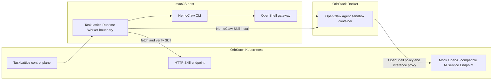

# NemoClaw and OpenShell Runtime Validation on OrbStack

Status: completed local proof of concept

Validation date: 2026-07-14
Environment: macOS Apple Silicon, OrbStack Docker and Kubernetes

## 1. Decision

NemoClaw with OpenShell is technically feasible as a TaskLattice Agent runtime on the tested OrbStack machine, with an important boundary:

- The supported Apple Silicon path uses the OpenShell Docker driver.
- The Agent sandbox is a Docker container, not a Pod in the existing OrbStack Kubernetes cluster.
- Kubernetes can run the TaskLattice control plane and AI Service Endpoints, while a host-side Runtime Worker operates NemoClaw through Docker.
- The existing Kubernetes cluster must not be presented as the NemoClaw compute plane. NemoClaw's legacy embedded-k3s implementation is not the default topology and is not the OrbStack cluster.

The local proof of concept is a **GO**. A shared internal environment is a **conditional GO** after TaskLattice adds lifecycle normalization, Skill reconciliation, metrics export, version pinning, and dedicated Runtime Hosts. Deploying NemoClaw directly as Kubernetes-native Agent Pods is a **NO-GO with the currently validated upstream path**.

## 2. Validated topology

The mock AI Service and Skill HTTP source ran in Kubernetes. `host.docker.internal:8000` provided the route from the Docker sandbox to the Kubernetes Service port-forward. This proved the control/runtime integration boundary, not a recommended production network path. Production must use stable internal DNS, TLS, and an authenticated gateway instead of a developer port-forward.

## 3. Test environment

| Component | Observed value |
| --- | --- |
| OrbStack Kubernetes | `v1.34.8+orb1`, one `arm64` control-plane node, context `orbstack` |
| Container runtime | Docker `29.4.0`, `overlay2` |
| Docker resources | 4 vCPU, 7.8 GiB visible memory |
| NemoClaw | `v0.1.0`, source revision `b00e2f21fe160eb26b0c626aa134d0014488f39b` |
| OpenShell | `0.0.72` |
| OpenClaw in sandbox | `2026.6.10` |
| Agent sandbox | `tasklattice-core-runtime`, Docker driver, `arm64` |
| Inference provider | Kubernetes-hosted OpenAI-compatible mock endpoint |
| Web search | disabled for this test |
| GPU | disabled for this test |

The machine is on the edge of the published minimum. OrbStack is configured with 8 GiB, but Docker exposes approximately 7.8 GiB. NemoClaw's resource check therefore failed unless `NEMOCLAW_IGNORE_RUNTIME_RESOURCES=1` was set. This override was acceptable for the local proof of concept, but must not be the production default.

OrbStack is not in the upstream prerequisite list, which names Colima and Docker Desktop for macOS. The result demonstrates compatibility with the tested versions only; it is not an upstream support guarantee.

## 4. Execution results

| Validation | Result | Evidence and implication |
| --- | --- | --- |
| Kubernetes baseline | Pass | OrbStack node was `Ready`; CoreDNS and local-path provisioner were healthy. |
| OpenShell gateway health | Pass | Direct gateway probe returned `200` for `/healthz` and `/readyz`; database readiness was healthy. |
| OpenShell security default | Pass | An unauthenticated Docker sandbox create was rejected because gateway JWT authentication was not configured. |
| NemoClaw onboarding | Pass with fallback | Custom-provider validation, tool-call validation, image build, policy application, and sandbox creation completed. |
| Docker image build | Pass with operational cost | OrbStack lacked `docker buildx`; NemoClaw first waited for that path, then used its gateway builder. The gateway build executed 143 steps in about 75 seconds. |
| Sandbox readiness | Pass | `status --json` reported `Ready`, Docker driver, OpenShell `0.0.72`, and healthy end-to-end inference. |
| Runtime diagnostics | Pass | `doctor --json` reported zero failed checks and zero warnings after onboarding. |
| Sandbox command execution | Pass | Command ran as sandbox UID 998 on `aarch64`; OpenClaw configuration was present. |
| Agent inference | Pass | An OpenClaw Agent request returned the expected `TALI_AGENT_OK` marker. |
| OpenShell inference mediation | Pass | Audit logs showed allowed network access to `inference.local:443` and routing to the Kubernetes-hosted compatible endpoint. |
| HTTP Skill retrieval | Pass | Runtime Worker-side fetch returned a valid `SKILL.md`; SHA-256 was calculated before installation. |
| Skill installation | Pass | NemoClaw validated, uploaded, installed, and observed the `runtime-probe` Skill. |
| Stop and start | Partial | The sandbox restarted and inference recovered, but state reporting was temporarily misleading and the installed Skill was lost after container replacement. |
| Kubernetes-native sandbox | Not supported by validated path | No NemoClaw/OpenShell Pod was created. The sandbox was an `openshell-*` Docker container. |

## 5. Important lifecycle findings

### 5.1 Stop state needs TaskLattice normalization

`nemoclaw stop` preserved the workspace and stopped the container, but the container appeared as `Exited (137)`. Immediately afterward, `nemoclaw status --json` reported an `Error` phase with `sandbox_dashboard_port_conflict` rather than a stable `Stopped` phase. A later `start` passed through a transient error state before reaching `Ready` with healthy inference.

TaskLattice must not expose the upstream phase directly as its user-visible lifecycle state. The adapter must combine:

- TaskLattice desired state;
- OpenShell/NemoClaw observed state;
- Docker container state;
- a start/stop grace period;
- Agent and inference health probes.

Recommended mapping:

| TaskLattice desired state | Observed evidence | TaskLattice state |
| --- | --- | --- |
| `STOPPED` | Sandbox container exited or absent after a successful stop operation | `STOPPED` |
| `RUNNING` | Start is recent and container or inference is not ready | `STARTING` |
| `RUNNING` | Sandbox `Ready`, Agent probe succeeds, inference route succeeds | `READY` |
| `RUNNING` | Grace period expired and a required probe still fails | `DEGRADED` or `ERROR` with failure layer |

### 5.2 Skill installation is not durable across sandbox replacement

The installed Skill was present before stop. `start` recreated the sandbox container, restored the Agent, and restored inference, but the Skill was absent. Re-running the supported NemoClaw Skill install command restored it.

Therefore:

- a successful Skill install is an observation about the current sandbox container, not a durable platform fact;
- TaskLattice must store desired Skill Bindings outside NemoClaw;
- create, start, recover, rebuild, and host migration must all trigger Skill reconciliation;
- reconciliation must compare name and verified artifact digest, then reinstall missing or mismatched Skills from the immutable cache;
- an Agent becomes `READY` only after required Skills are observed.

This makes S3 useful as the durable L3 Skill cache, but it does not make S3 a runtime filesystem. The trusted Runtime Worker should fetch the immutable artifact from S3 into a host-local cache and call the supported NemoClaw install operation.

## 6. Observability assessment

### 6.1 Coverage

| Signal | Assessment | Validated source | TaskLattice action |
| --- | --- | --- | --- |
| Lifecycle status | Good with semantic gaps | `nemoclaw status --json` | Normalize desired and observed state; do not pass through the upstream phase verbatim. |
| Runtime diagnostics | Good | `nemoclaw doctor --json` | Run after create/start/recover and on demand; persist individual check results. |
| Application logs | Good | `nemoclaw logs` | Stream to the centralized log backend with project, Agent Instance, sandbox, host, and operation IDs. |
| Security/network audit | Good | OpenShell OCSF-like audit events | Preserve decision, destination, protocol, policy, sandbox, and timestamp fields. Alert on denied or unexpected destinations. |
| Inference routing | Good | OpenShell routing logs | Record route and health, but redact credentials and request content by default. |
| Onboarding traces | Very good when enabled | `NEMOCLAW_TRACE=1` JSON trace | Attach the trace to the Runtime Operation; enforce retention and size limits. |
| Agent runtime traces | Available, opt-in | `NEMOCLAW_OPENCLAW_OTEL=1` | Enable in the tested Runtime Profile and send OTLP to a local collector. Rebuild is required when changing this setting. |
| Prometheus metrics | Incomplete in NemoClaw-managed path | OpenShell supports a metrics listener, but the managed gateway did not expose one by default | Add supported gateway metrics configuration when upstream exposes it; meanwhile collect host/container metrics and adapter-owned operation metrics. |
| Kubernetes Pod metrics/events | Not applicable | Sandbox is not a Kubernetes Pod | Do not promise Kubernetes-native runtime visibility. Observe Docker hosts and containers instead. |
| Resource capacity | Inconsistent | `nemoclaw resources` reported host capacity while `doctor` evaluated Docker capacity | Use Docker/Runtime Host capacity as scheduling truth. |

The merged runtime log was useful in practice. It included OpenClaw application logs, OpenShell audit events, allowed network connections, inference route and protocol details, Landlock configuration, and SSH relay lifecycle. It also surfaced actionable warnings about plugin allowlists, gateway binding, and control UI settings.

The most important gap is metrics. A directly launched OpenShell gateway exposed Prometheus data such as database readiness and probe duration when given a metrics port. The NemoClaw-managed gateway used in the successful runtime did not expose a dedicated metrics listener. TaskLattice should not patch generated gateway state in place; the adapter should pin a supported configuration contract or provide its own metrics around operations and host/container health until upstream exposes this surface.

### 6.2 Required TaskLattice telemetry

Every Runtime Worker operation should emit:

- `operation_id`, `project_id`, `agent_instance_id`, sandbox name, Runtime Host, Runtime Profile revision, and pinned component versions;
- desired state, normalized state, raw upstream phase, failure layer, exit code, and duration;
- inference route health and required Skill reconciliation result;
- bounded stdout/stderr references and redacted trace/log object references;
- counters and histograms for create, start, stop, destroy, probe, Skill install, and reconciliation;
- gauges for ready Agents, degraded Agents, Runtime Host capacity, container memory/CPU, and reconciliation backlog.

Minimum alerts:

- create/start exceeds the profile timeout;
- sandbox is ready but inference or Agent probe fails;
- required Skill is missing after a lifecycle operation;
- Runtime Host free memory or disk is below threshold;
- repeated OpenShell policy denial or unexpected allowed destination;
- adapter version, NemoClaw version, or OpenShell version differs from the pinned Runtime Profile.

## 7. Recommended production shape

Use Kubernetes for the TaskLattice control plane, queue workers that do not require a Docker socket, API services, policy services, and stable AI Service Endpoint ingress. Use a dedicated Runtime Host pool for NemoClaw.

Each Runtime Host should have:

- a supported Linux distribution and Docker configuration;
- capacity above the published minimum, with scheduling reservations and disk quotas;
- a pinned NemoClaw/OpenShell/OpenClaw compatibility set;
- one hardened Host Runner as the only component allowed to invoke the NemoClaw CLI;
- no user access to the Docker socket;
- a local artifact cache, OTLP collector, log shipper, and container/host metrics collector;
- host admission and drain controls so TaskLattice can stop placing new Agents before maintenance.

Do not run the Host Runner as a privileged Kubernetes Pod merely to reach the host Docker socket. That would create a high-impact cluster escape boundary without making the upstream runtime Kubernetes-native.

## 8. Adapter acceptance criteria

Before using this runtime for a shared internal environment, automate the following contract test for every pinned version set:

1. Create a sandbox against a compatible AI Service Endpoint.
2. Verify `status --json`, `doctor --json`, Agent inference, and OpenShell-mediated network routing.
3. Resolve and install a Skill by approved digest.
4. Stop and start the Agent.
5. Normalize the transient upstream states correctly.
6. Detect the missing Skill and reconcile it automatically.
7. Confirm the Agent is not marked `READY` until inference and required Skills are healthy.
8. Export logs, traces, metrics, and an immutable Runtime Operation audit record.
9. Destroy the sandbox and verify that credentials, containers, and runtime state are removed according to policy.

## 9. Final recommendation

| Target | Decision | Reason |
| --- | --- | --- |
| Developer POC on the tested OrbStack machine | GO | Agent execution, policy mediation, inference, lifecycle, and Skill installation all worked. |
| Internal low-scale TaskLattice runtime | Conditional GO | Requires the adapter reconciliation and observability work in this document. |
| Existing OrbStack Kubernetes as the direct NemoClaw sandbox scheduler | NO-GO | The validated supported topology creates Docker containers, not Pods in that cluster. |
| Production runtime | Conditional GO on dedicated Linux Docker hosts | Avoids macOS/OrbStack support ambiguity and provides explicit capacity, security, and telemetry boundaries. |

## 10. Official references

- [NemoClaw prerequisites](https://docs.nvidia.com/nemoclaw/latest/user-guide/openclaw/get-started/prerequisites.md)
- [NemoClaw quickstart](https://docs.nvidia.com/nemoclaw/latest/user-guide/openclaw/get-started/quickstart.md)
- [NemoClaw architecture](https://docs.nvidia.com/nemoclaw/latest/user-guide/openclaw/reference/architecture.md)
- [NemoClaw runtime controls](https://docs.nvidia.com/nemoclaw/latest/user-guide/openclaw/manage-sandboxes/runtime-controls.md)
- [Monitor sandbox activity](https://docs.nvidia.com/nemoclaw/latest/user-guide/openclaw/monitoring/monitor-sandbox-activity.md)
- [NemoClaw command reference](https://docs.nvidia.com/nemoclaw/latest/user-guide/openclaw/reference/commands.md)
- [OpenAI-compatible endpoint setup](https://docs.nvidia.com/nemoclaw/latest/user-guide/openclaw/inference/custom-endpoints/set-up-openai-compatible-endpoint.md)
- [NVIDIA/NemoClaw source repository](https://github.com/NVIDIA/NemoClaw)
