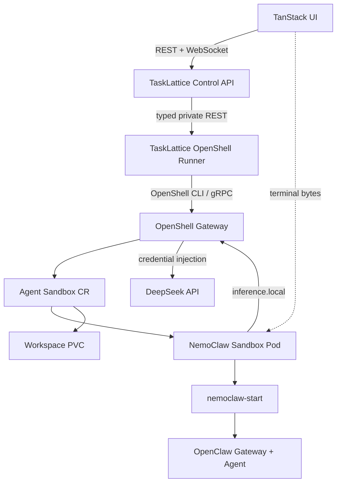

# OpenShell Kubernetes Agent Runtime

Status: experimental local MVP

Pinned versions:

- OpenShell `0.0.82`
- Agent Sandbox `0.5.1`
- OpenClaw `2026.6.10`
- NemoClaw source revision `2adc8481ff3053a5a7be37d130cb183e222934ff`

## Decision

TaskLattice uses OpenShell's Kubernetes driver for the Kubernetes-native sandbox
lifecycle. Each created Agent maps to an OpenShell `Sandbox` resource, a
same-name Kubernetes Pod, and a workspace PVC. The browser terminal reaches the
same Pod through OpenShell's gRPC exec relay.

Generated Sandbox and Pod names use the short operational prefix `tali-` and
stay at or below 28 characters because OpenShell uses the Sandbox name as part
of its browser service-routing hostname.

TaskLattice does not run the Docker-oriented `nemoclaw onboard` host lifecycle inside a
privileged Pod. It uses OpenShell's Kubernetes driver while preserving the
official in-sandbox runtime shape: OpenShell is PID 1, `nemoclaw-start` is its
long-lived non-root child, and that supervisor owns the OpenClaw gateway. The
sandbox image is built from pinned NVIDIA NemoClaw source and includes the
NemoClaw plugin, generated OpenClaw configuration, supervisor, and health check.

## Security boundary

- The runner has no Docker socket and no Kubernetes ServiceAccount token.
- The Agent Pod does not receive the DeepSeek API key.
- The runner sends the key to `openshell provider create` through the process
  environment, never through argv.
- OpenShell stores and injects provider credentials at the gateway boundary.
- The local chart deliberately disables TLS and authentication. These settings
  are only acceptable in a trusted local cluster and must be replaced for a
  shared environment.

## Production gaps

OpenShell's Kubernetes integration is currently alpha/experimental. Before a
shared deployment, add authenticated TLS gateway access, a real registry,
per-tenant namespaces and quotas, NetworkPolicies, external secret management,
durable runner operation state, startup-command reconciliation after a Sandbox
Pod recreation, and concurrency-safe inference profiles.
