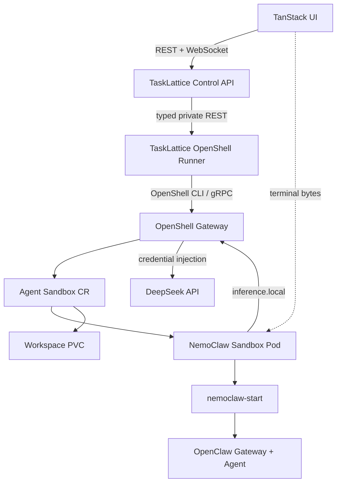

# OpenShell Kubernetes Agent Runtime

Status: experimental local MVP

Pinned versions:

- OpenShell `0.0.82`
- Agent Sandbox `0.5.1`
- OpenClaw `2026.6.10`
- NemoClaw source revision `2adc8481ff3053a5a7be37d130cb183e222934ff`

## Decision

TaskLattice uses OpenShell's Kubernetes driver for the Kubernetes-native sandbox
lifecycle. Each created Agent maps to an OpenShell `Sandbox` resource, a
same-name Kubernetes Pod, and a workspace PVC. The browser terminal reaches the
same Pod through OpenShell's gRPC exec relay.

Generated Sandbox and Pod names use the short operational prefix `tali-` and
stay at or below 28 characters because OpenShell uses the Sandbox name as part
of its browser service-routing hostname.

TaskLattice does not run the Docker-oriented `nemoclaw onboard` host lifecycle inside a
privileged Pod. It uses OpenShell's Kubernetes driver while preserving the
official in-sandbox runtime shape: OpenShell is PID 1, `nemoclaw-start` is its
long-lived non-root child, and that supervisor owns the OpenClaw gateway. The
sandbox image is built from pinned NVIDIA NemoClaw source and includes the
NemoClaw plugin, generated OpenClaw configuration, supervisor, and health check.



## Security boundary

- The runner has no Docker socket and no Kubernetes ServiceAccount token.
- The Agent Pod does not receive the DeepSeek API key.
- The runner sends the key to `openshell provider create` through the process
  environment, never through argv.
- OpenShell stores and injects provider credentials at the gateway boundary.
- The local chart deliberately disables TLS and authentication. These settings
  are only acceptable in a trusted local cluster and must be replaced for a
  shared environment.

## Local installation

Requirements: Kubernetes 1.29+, Helm, Docker/OrbStack, `kubectl`, and Node.js 22.

```sh
cp .env.example .env
# Set DEEPSEEK_API_KEY in .env.
npm run k8s:install-openshell
npm run images:build
npm run k8s:deploy:openshell
kubectl -n tasklattice-sandboxes rollout status deployment/tasklattice-control
kubectl -n tasklattice-sandboxes rollout status deployment/tasklattice-openshell-runner
```

The local deploy command creates an ignored Kubernetes Secret from `.env`.
The test-only TaskLattice seed loads the DeepSeek key from that environment and stores
it in SQLite. On first Agent
creation the private runner request provides it to OpenShell, which creates the
`tasklattice-deepseek` OpenAI-compatible provider and validates
`deepseek-chat`/`deepseek-reasoner` through `inference set`.

Expose the control API:

```sh
kubectl -n tasklattice-sandboxes port-forward service/tasklattice-control 18081:80
```

The local OpenShell Helm values create its gateway Service as a
`LoadBalancer`. OrbStack exposes LoadBalancer ports directly on localhost, so
the per-Instance `http://<sandbox>--webui.openshell.localhost:8080/` URL works
without a second port-forward. The runner uses `OPENSHELL_SERVICE_BASE_URL` to
install that exact routed Origin before NemoClaw seals and validates its
configuration, then returns an authenticated URL whose token stays in the URL
fragment.

Confirm that OrbStack assigned the gateway address, then run the proof path:

```sh
kubectl -n openshell get service openshell
```

```sh
TALI_BASE_URL=http://127.0.0.1:18081 TALI_EXPECT_NEMOCLAW_RUNTIME=1 npm run validate:core
```

The validator proves all of the following before it deletes the Agent:

1. REST creation reaches `READY`.
2. OpenShell publishes the NemoClaw Web UI as the named `webui` HTTP Endpoint,
   the endpoint returns HTTP 200, and OpenClaw accepts its routed WebSocket
   Origin.
3. A terminal WebSocket enters the same-name Sandbox Pod.
4. `/etc/hostname` equals the Agent's `sandboxName`.
5. `openclaw --version` returns the pinned version.
6. `/usr/local/bin/nemoclaw-start` exists, remains running, and the gateway
   answers `http://127.0.0.1:18789/health`.
7. Agent deletion removes the REST resource, HTTP Endpoint, and OpenShell runtime.

Useful runtime inspection:

```sh
kubectl -n openshell get sandboxes,pods,pvc
kubectl -n tasklattice-sandboxes logs deployment/tasklattice-openshell-runner
```

## Production gaps

OpenShell's Kubernetes integration is currently alpha/experimental. Before a
shared deployment, add authenticated TLS gateway access, a real registry,
per-tenant namespaces and quotas, NetworkPolicies, external secret management,
durable runner operation state, startup-command reconciliation after a Sandbox
Pod recreation, and concurrency-safe inference profiles.
