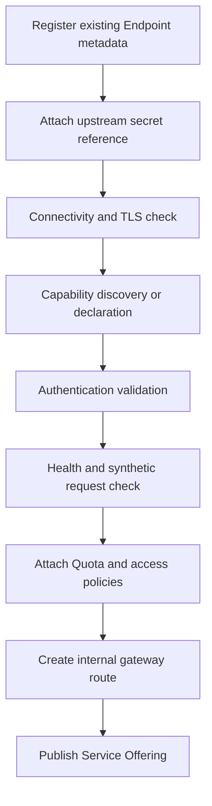
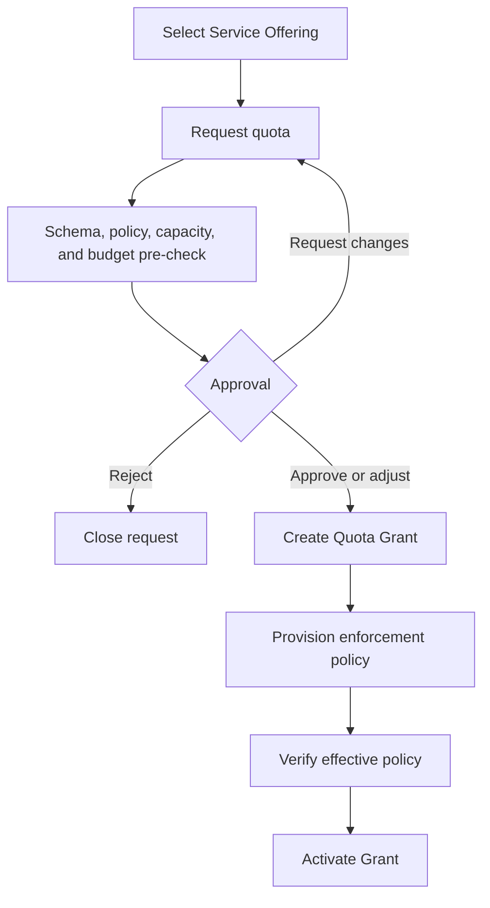

# TaskLattice Marketplace Technical Implementation

Status: Draft

Version: 0.2

## 1. Purpose

TaskLattice is an internal AI Service Marketplace and Agent Control Plane.

The platform assumes that AI services already exist and expose runnable endpoints. It integrates those endpoints into a catalog, governs who may use them and how much quota they receive, and manages Agents that can load approved Skills while running.

~~~text
Existing AI Service Endpoint
  -> register Endpoint
  -> publish Service Offering
  -> request and approve quota
  -> activate Quota Grant
  -> access through the internal gateway

Create Agent
  -> bind active Quota Grants
  -> start Agent
  -> bind approved Skill versions
  -> load Skills into the running Agent
  -> observe, upgrade, roll back, or unload Skills
~~~

## 2. Scope and explicit boundaries

### 2.1 In scope

- Register existing internal or vendor AI Service Endpoints.
- Maintain a searchable AI Service Catalog.
- Validate Endpoint connectivity, capabilities, authentication, and health.
- Request, approve, activate, expire, and revoke service-specific quota.
- Enforce request, token, concurrency, usage, and budget limits.
- Issue stable internal access without exposing upstream credentials.
- Create, start, stop, update, and delete Agents.
- Register, version, validate, approve, and distribute Skills.
- Load, activate, deactivate, upgrade, and unload Skills in running Agents.
- Bind Agent identities to active Quota Grants.
- Provide audit, usage, performance, health, and cost visibility.
- Isolate UAT and PROD access, credentials, quotas, and Agent runtimes.

### 2.2 Explicitly out of scope

- Managing compute for the upstream AI Service.
- Starting, scaling, or deploying the upstream AI Service.
- Importing or storing AI artifacts.
- Operating an inference-serving control plane.
- Training or fine-tuning.
- Public marketplace payment or seller settlement.
- Claiming hard quota enforcement when consumers bypass the internal gateway.

Every registered Endpoint is treated as an external dependency with its own owner and lifecycle.

## 3. Product terminology

| Term | Meaning |
|---|---|
| AI Service | A logical capability such as chat, embedding, rerank, image, audio, or custom AI API |
| Service Endpoint | An already-running upstream URL plus authentication and integration metadata |
| Service Offering | A user-visible, environment-specific catalog entry backed by an Endpoint |
| Quota Policy | Supported dimensions, defaults, boundaries, duration, and approval rules |
| Quota Request | A project request to use a specified Offering |
| Quota Grant | Approved and provisioned limits for a project and Offering |
| AI Service Gateway | Internal access layer that authenticates, enforces quota, meters usage, and forwards requests |
| Agent Definition | Desired Agent configuration, ownership, service bindings, and Skill bindings |
| Agent Instance | A running Agent process managed through a runtime adapter |
| Skill Version | An immutable Skill package and permission manifest |
| Skill Binding | Desired association between an Agent and a Skill Version |
| Skill Load Operation | Tracked prepare, activate, roll back, upgrade, or unload action |

## 4. Roles

| Role | Responsibility |
|---|---|
| Requester | Browse services, request quota, create Agents, and request Skill bindings |
| Service Owner | Register Endpoint metadata and own availability information |
| Quota Approver | Approve limits, duration, environment, and budget |
| Skill Publisher | Publish Skill packages and permission manifests |
| Skill Reviewer | Review Skill provenance, dependencies, secrets, network access, and side effects |
| Agent Operator | Maintain Agent runtime integrations and investigate runtime failures |
| Platform Administrator | Manage adapters, policies, runtimes, identity, and gateway configuration |
| Auditor | Read approval, access, runtime, Skill, usage, and cost history |

For PROD, a requester cannot be the final approver of their own request.

## 5. High-level architecture

~~~mermaid
flowchart LR
    USER["Requester / Approver / Admin"] --> UI["Marketplace Web Portal"]
    UI --> API["Marketplace API / BFF"]

    subgraph CONTROL["TaskLattice Control Plane"]
        API --> CATALOG["AI Service Catalog"]
        API --> REQUEST["Request and Approval"]
        API --> QUOTA["Quota Service"]
        API --> AGENT["Agent Service"]
        API --> SKILL["Skill Registry"]
        CATALOG --> DB[(PostgreSQL)]
        REQUEST --> DB
        QUOTA --> DB
        AGENT --> DB
        SKILL --> DB
        REQUEST --> OUTBOX["Transactional Outbox"]
        SKILL --> PACKAGE[("Skill Package Registry")]
        OUTBOX --> WORKER["Control Worker"]
    end

    subgraph ACCESS["AI Service Access Plane"]
        GATEWAY["AI Service Gateway"] --> ADAPTER["Provider Adapters"]
        GATEWAY --> USAGE["Usage Meter"]
    end

    ADAPTER --> INTERNAL["Existing Internal AI Service"]
    ADAPTER --> VENDOR["Existing Vendor AI Service"]

    subgraph RUNTIME["Agent Runtime Plane"]
        MANAGER["Agent Runtime Manager"] --> RUNNING["Running Agents"]
        LOADER["Skill Loader"] --> RUNNING
    end

    WORKER --> GATEWAY
    WORKER --> MANAGER
    WORKER --> LOADER
    PACKAGE --> LOADER
    RUNNING --> GATEWAY
    USAGE --> QUOTA
~~~

### 5.1 Boundaries

The control plane stores Service, Endpoint, Offering, Quota, Agent, Skill, approval, desired state, and audit records. It provisions gateway policy and Agent runtime operations, then reconciles effective state.

The gateway authenticates consumers, maps a stable Offering route to the upstream Endpoint, enforces the active Grant, meters usage, applies provider adapters, and hides upstream credentials.

The Agent Runtime Manager creates and starts Agents, supplies short-lived service identities, loads Skills through a versioned protocol, reports observed state, and rolls back failed Skill activation.

The first release should use a modular control API, one control worker, one gateway integration, and one Agent Runtime adapter.

## 6. Existing Endpoint integration

Endpoint registration is an administrative or Service Owner operation. Normal users request quota from published Offerings and cannot create arbitrary upstream routes.

Registration stores connection metadata and secret references only. It does not manage the implementation behind the Endpoint.

### 6.1 Endpoint and protocol types

~~~text
Endpoint types:
  CHAT
  TEXT_GENERATION
  EMBEDDING
  RERANK
  IMAGE
  AUDIO
  MULTIMODAL
  CUSTOM

Protocol types:
  OPENAI_COMPATIBLE
  HTTP_JSON
  GRPC
  PROVIDER_NATIVE
  CUSTOM_ADAPTER
~~~

Provider-specific transformations belong in versioned ProviderAdapter implementations.

### 6.2 Registration flow

Validation uses synthetic, provider-approved payloads and does not transmit sensitive company data.

### 6.3 ServiceEndpoint

~~~text
id
service_id
environment
upstream_base_url
protocol_type
adapter_id
authentication_type
secret_reference
health_check_config
tls_policy
timeout_policy
retry_policy
owner_team
status
last_validated_at
~~~

Credentials remain in the company secret system and are referenced by identifier.

~~~text
DRAFT -> VALIDATING -> READY -> PUBLISHED

Operational alternatives:
  VALIDATION_FAILED
  DEGRADED
  UNAVAILABLE
  SUSPENDED
  RETIRED
~~~

READY means integration checks passed. PUBLISHED means at least one user-visible Offering exists.

## 7. Service Catalog

### 7.1 AIService

~~~text
id
name
description
service_type
provider
capabilities_json
owner_team
documentation_url
lifecycle_status
created_at
updated_at
~~~

### 7.2 ServiceOffering

~~~text
id
service_id
endpoint_id
environment
display_name
capabilities_json
quota_policy_id
pricing_profile_id
availability_status
capacity_status
published_at
retired_at
~~~

Availability values are AVAILABLE, CAPACITY_LIMITED, SUSPENDED, and RETIRED.

The detail page shows capabilities, environment, data-handling classification, owner, health, quota policy, pricing, project usage, and Request Quota. It does not show the upstream URL or credentials.

## 8. Quota request and enforcement

### 8.1 Dimensions

~~~text
requests_per_minute
requests_per_day
tokens_per_minute
input_tokens_per_month
output_tokens_per_month
max_concurrency
max_request_size
monthly_budget
valid_from
valid_until
~~~

Offering-specific typed dimensions can include images, audio minutes, embedding items, provider credit units, or custom usage units. Each Offering declares a schema; unknown dimensions are rejected.

### 8.2 QuotaRequest

~~~text
id
offering_id
project_id
environment
requester_id
use_case
data_classification
cost_center
requested_limits_json
requested_duration
estimated_cost
status
created_at
~~~

### 8.3 QuotaGrant

~~~text
id
quota_request_id
offering_id
project_id
environment
granted_limits_json
effective_at
expires_at
enforcement_mode
status
version
~~~

Approvers may grant lower limits than requested. Requested and granted values both remain immutable audit inputs.

### 8.4 Enforcement modes

| Mode | Behavior |
|---|---|
| GATEWAY | Internal gateway enforces quota before forwarding; default |
| PROVIDER_DELEGATED | Adapter provisions and verifies a provider-side limit |
| OBSERVE_ONLY | Usage is measured but no hard limit is guaranteed |

OBSERVE_ONLY must be visibly labeled and cannot satisfy a PROD hard-limit requirement.

### 8.5 Request flow

~~~text
DRAFT
-> SUBMITTED
-> POLICY_CHECKING
-> PENDING_APPROVAL
-> APPROVED
-> PROVISIONING
-> ACTIVE

Alternative states:
  CHANGES_REQUESTED
  REJECTED
  PROVISIONING_FAILED
  SUSPENDED
  EXPIRED
  REVOKED
  CANCELLED
~~~

APPROVED is a business decision. ACTIVE means enforcement is confirmed.

For every call, the gateway evaluates identity, project membership, target Offering, active matching Grant, permitted operation, rate/concurrency/usage state, budget policy, and upstream route.

Grant increase creates a new approval request. Expiration and revocation stop new calls and invalidate associated Agent service identities.

## 9. Agent lifecycle

### 9.1 AgentDefinition

~~~text
id
name
project_id
environment
runtime_profile_id
owner_team
description
system_instruction
desired_state
status
version
created_at
updated_at
~~~

Service access is represented by AgentServiceBinding records referencing active Grants.

### 9.2 AgentInstance

~~~text
id
agent_definition_id
runtime_adapter_id
runtime_instance_ref
runtime_endpoint
desired_revision
observed_revision
desired_state
observed_state
health_status
last_heartbeat_at
created_at
~~~

~~~text
DRAFT
-> PENDING_APPROVAL
-> APPROVED
-> CREATING
-> STARTING
-> RUNNING

Operational alternatives:
  UPDATING
  DEGRADED
  STOPPING
  STOPPED
  DELETING
  DELETED
  FAILED
~~~

### 9.3 Creation flow

~~~mermaid
flowchart TD
    DEFINE["Define Agent"] --> BIND["Bind active service Quota Grants"]
    BIND --> CONFIG["Select runtime profile and base configuration"]
    CONFIG --> CHECK["Validate access, secrets, and policy"]
    CHECK --> APPROVAL{"Approval required?"}
    APPROVAL -->|Yes| WAIT["Approval workflow"]
    APPROVAL -->|No| CREATE["Create runtime instance"]
    WAIT --> CREATE
    CREATE --> START["Start Agent"]
    START --> IDENTITY["Issue short-lived Agent identity"]
    IDENTITY --> HEALTH["Verify heartbeat and service access"]
    HEALTH --> RUNNING["Agent RUNNING"]
~~~

A running Agent receives internal gateway routes and short-lived grant-scoped identity. It never receives upstream credentials. Usage is attributed to Agent Instance, project, Offering, and Grant.

## 10. Skill Registry

### 10.1 Skill and SkillVersion

~~~text
Skill:
  id
  name
  description
  publisher_team
  category
  lifecycle_status

SkillVersion:
  id
  skill_id
  version
  package_uri
  package_digest
  runtime_compatibility
  manifest_json
  status
  published_at
~~~

Every Skill Version is immutable. Code, dependency, configuration schema, or permission changes create a new version.

### 10.2 Manifest

~~~yaml
apiVersion: tasklattice.ai/v1
kind: Skill
metadata:
  name: knowledge-search
  version: 1.2.0
runtime:
  type: python
  entrypoint: tasklattice_skill:create_skill
  compatibleAgentRuntimes:
    - tasklattice-agent-python-v1
configuration:
  schemaRef: schemas/config.json
permissions:
  aiServices:
    - capability: embedding
  secrets:
    - name: knowledge_api
      access: read
  network:
    egress:
      - api.internal.example.com:443
  sideEffects:
    - type: external_read
health:
  check: tasklattice_skill:health
reload:
  strategy: hot
  rollbackOnFailure: true
~~~

Publication verifies package digest and publisher, scans dependencies, validates configuration and permissions, checks runtime compatibility, and tests load, health, unload, and rollback in an isolated Agent.

## 11. Loading Skills into running Agents

### 11.1 SkillBinding

~~~text
id
agent_definition_id
skill_version_id
configuration_json
secret_bindings_json
desired_state
observed_state
approval_status
version
created_at
updated_at
~~~

Configuration contains non-secret values and secret references only.

### 11.2 Runtime sequence

~~~mermaid
sequenceDiagram
    participant U as User
    participant API as Control API
    participant W as Control Worker
    participant R as Agent Runtime Manager
    participant A as Running Agent
    participant P as Skill Package Registry

    U->>API: Bind Skill Version
    API->>API: Validate policy, compatibility, config
    API-->>U: Accepted or pending approval
    W->>P: Resolve immutable package digest
    W->>R: PrepareSkill
    R->>A: Stage package and configuration
    A-->>R: Prepared
    W->>R: ActivateSkill
    R->>A: Load Skill and run health check
    A-->>R: Active with observed version
    R-->>W: Activation confirmed
    W->>API: observed_state = ACTIVE
~~~

Loading uses two phases:

1. PREPARE fetches the package, verifies digest, resolves configuration, validates permissions, and initializes without receiving calls.
2. ACTIVATE adds the Skill to the Agent dispatcher and runs a health check.

If activation fails, remove the failed version, reactivate the previous healthy version, record sanitized details, and keep the Agent running when safe.

| Strategy | Behavior |
|---|---|
| HOT_LOAD | Prepare and activate inside the running process |
| ROLLING_RESTART | Start a new Agent revision, verify it, then switch traffic |
| FULL_RESTART | Restart the same runtime when interruption is permitted |

The user action remains Load Skill; the runtime adapter selects and records the strategy.

### 11.3 SkillLoadOperation

~~~text
id
agent_instance_id
skill_binding_id
operation_type
requested_version
previous_version
strategy
status
attempt
error_code
error_message
started_at
completed_at
~~~

Statuses: QUEUED, PREPARING, PREPARED, ACTIVATING, ACTIVE, ROLLING_BACK, ROLLED_BACK, FAILED, CANCELLED.

## 12. Agent runtime adapter contract

The NVIDIA NemoClaw adapter, HTTP Skill resolution flow, and S3/local-cache design are specified in [runtime-implementation.md](./runtime-implementation.md).

~~~text
CreateAgent(definition, revision) -> runtime_instance_ref
StartAgent(runtime_instance_ref) -> operation_ref
StopAgent(runtime_instance_ref) -> operation_ref
DeleteAgent(runtime_instance_ref) -> operation_ref
GetAgentStatus(runtime_instance_ref) -> observed state
PrepareSkill(runtime_instance_ref, binding, package) -> operation_ref
ActivateSkill(runtime_instance_ref, binding) -> operation_ref
DeactivateSkill(runtime_instance_ref, binding) -> operation_ref
UnloadSkill(runtime_instance_ref, binding) -> operation_ref
GetLoadedSkills(runtime_instance_ref) -> observed versions
RotateServiceIdentity(runtime_instance_ref) -> operation_ref
~~~

Adapters must support idempotency, timeout, cancellation, operation status, desired/observed revisions, stable error codes, secret-safe responses, and restart reconciliation.

## 13. Domain entities

~~~mermaid
erDiagram
    TENANT ||--o{ PROJECT : contains
    AI_SERVICE ||--o{ SERVICE_ENDPOINT : exposes
    AI_SERVICE ||--o{ SERVICE_OFFERING : publishes
    SERVICE_ENDPOINT ||--o{ SERVICE_OFFERING : backs
    SERVICE_OFFERING ||--o{ QUOTA_POLICY : governed_by
    SERVICE_OFFERING ||--o{ QUOTA_REQUEST : requested_for
    QUOTA_REQUEST ||--o| QUOTA_GRANT : creates
    QUOTA_GRANT ||--o{ QUOTA_USAGE : accumulates
    PROJECT ||--o{ AGENT_DEFINITION : owns
    AGENT_DEFINITION ||--o{ AGENT_INSTANCE : realizes
    AGENT_DEFINITION ||--o{ AGENT_SERVICE_BINDING : uses
    QUOTA_GRANT ||--o{ AGENT_SERVICE_BINDING : authorizes
    SKILL ||--o{ SKILL_VERSION : has
    AGENT_DEFINITION ||--o{ SKILL_BINDING : desires
    SKILL_VERSION ||--o{ SKILL_BINDING : selected_by
    SKILL_BINDING ||--o{ SKILL_LOAD_OPERATION : applied_by
    CHANGE_REQUEST ||--o{ APPROVAL_STEP : contains
    APPROVAL_STEP ||--o{ APPROVAL_ACTION : records
~~~

AgentServiceBinding contains Agent Definition, Grant, Offering, permitted operations, and status. The active Grant is the authorization boundary.

QuotaUsage contains Grant, optional Agent Instance, consumer identity, usage type/value/unit, request count, cost, time window, and source.

## 14. Approval and audit

Governed changes:

~~~text
QUOTA_GRANT
QUOTA_INCREASE
QUOTA_REVOKE
AGENT_CREATE
AGENT_UPDATE
AGENT_DELETE
SKILL_PUBLISH
SKILL_BIND
SKILL_UPGRADE
SKILL_UNLOAD
SERVICE_PUBLISH
SERVICE_SUSPEND
~~~

Approval actions: APPROVE, APPROVE_WITH_CHANGES, REJECT, REQUEST_CHANGES, CANCEL.

Skill approval evaluates combined Agent, Grant, existing Skill, and requested Skill permissions. A Skill safe in isolation can still create an unsafe combination.

Audit links each Quota Request to its Grant, gateway policy, Agent bindings, usage, and revocation. Skill requests link to package digest, approval, runtime operation, observed version, and rollback.

## 15. API design

~~~text
Catalog:
  GET  /api/v1/services
  GET  /api/v1/services/{serviceId}
  GET  /api/v1/offerings
  GET  /api/v1/offerings/{offeringId}
  GET  /api/v1/offerings/{offeringId}/health

Administrative Endpoint integration:
  POST /api/v1/admin/endpoints
  POST /api/v1/admin/endpoints/{endpointId}/validate
  POST /api/v1/admin/endpoints/{endpointId}/publish
  POST /api/v1/admin/endpoints/{endpointId}/suspend

Quota:
  POST /api/v1/quota-requests
  GET  /api/v1/quota-requests/{requestId}
  GET  /api/v1/quota-grants
  GET  /api/v1/quota-grants/{grantId}/usage
  POST /api/v1/quota-grants/{grantId}/increase-requests
  POST /api/v1/quota-grants/{grantId}/revoke-requests

Agents:
  POST /api/v1/agents
  GET  /api/v1/agents/{agentId}
  POST /api/v1/agents/{agentId}/start
  POST /api/v1/agents/{agentId}/stop
  GET  /api/v1/agents/{agentId}/runtime-status
  POST /api/v1/agents/{agentId}/service-bindings

Skills:
  GET  /api/v1/skills
  POST /api/v1/agents/{agentId}/skill-bindings
  POST /api/v1/agents/{agentId}/skill-bindings/{bindingId}/load
  POST /api/v1/agents/{agentId}/skill-bindings/{bindingId}/upgrade
  POST /api/v1/agents/{agentId}/skill-bindings/{bindingId}/unload
  GET  /api/v1/skill-load-operations/{operationId}
~~~

All mutating endpoints require an Idempotency-Key and expected resource version.

## 16. Events and reconciliation

~~~text
service_endpoint.registered
service_endpoint.validation_completed
service_offering.published
service_offering.suspended
quota_request.submitted
quota_grant.approved
quota_grant.provisioned
quota_grant.activated
quota_grant.expired
quota_grant.revoked
agent.create_requested
agent.created
agent.running
agent.degraded
agent.stopped
skill_binding.approved
skill_load.prepared
skill_load.activated
skill_load.failed
skill_load.rolled_back
usage.recorded
~~~

Business mutations and events use a transactional outbox. Consumers store processed event IDs and perform idempotent operations.

Reconciliation compares desired/effective gateway policy, desired/observed Agent revision, desired/observed Skill versions, and active Grant/Agent identity scopes. Restarts must not duplicate Agents, credentials, or Skill loads.

## 17. Security

- Corporate OIDC for users and workload identity for Agents and services.
- Project, environment, Offering, Grant, Agent, and Skill attributes in authorization decisions.
- Upstream credentials remain in the company secret system.
- Users and Agents receive only internal grant-scoped identities.
- Skill packages have immutable digests and verified publishers.
- Skills declare secrets, network access, side effects, and service capabilities.
- Default-deny secret and network access.
- Runtime load is blocked when package digest differs from the approved digest.
- Offerings declare data-handling classification.
- Prompt and response bodies are not logged by default.
- UAT and PROD use separate routes, Grants, Agent identities, secret scopes, and approval policies.

## 18. Observability, usage, and cost

~~~text
Control and runtime:
  endpoint_validation_duration
  endpoint_health_status
  quota_approval_duration
  quota_provision_duration
  quota_provision_failure_count
  agent_operation_duration
  agent_heartbeat_age
  skill_load_duration
  skill_load_failure_count
  skill_rollback_count
  reconciliation_error_count

Gateway and usage:
  request_rate
  success_rate
  error_rate
  upstream_latency
  gateway_latency
  active_requests
  rate_limit_rejections
  quota_exhaustion_rejections
  input_tokens
  output_tokens
  service_specific_usage_units
  loaded_skill_count
  skill_invocation_count
  skill_invocation_latency
  skill_invocation_errors
~~~

Cost is upstream provider usage plus gateway allocation, Agent runtime allocation, Skill external usage, and shared overhead. Estimated cost is shown during quota request; actual cost comes from gateway/provider and Agent runtime usage.

## 19. Failure handling

| Failure | Required behavior |
|---|---|
| Upstream unavailable | Stable gateway error, health degradation, optional block on new Grants and Agent bindings |
| Quota provisioning fails | Grant remains unusable; no credential issued; retry is idempotent |
| Agent creation fails | Preserve Definition, reconcile runtime reference, revoke unused identities |
| Skill activation fails | Remove failed version, restore previous version, keep Agent running where safe |
| Usage pipeline delayed | Keep local hard limits, expose stale watermark, never reset consumed quota |

## 20. Technical validation

### 20.1 Endpoint and quota vertical slice

~~~text
Register an existing test Endpoint
-> validate connectivity and authentication
-> publish Offering
-> submit Quota Request
-> approve with adjusted limits
-> provision gateway policy
-> issue grant-scoped access
-> call through gateway
-> verify routing, limits, usage, and cost
-> revoke Grant
-> verify access stops
~~~

### 20.2 Running Agent and Skill vertical slice

~~~text
Create Agent with an active Grant
-> start Agent
-> verify Agent calls through gateway
-> bind approved Skill Version
-> prepare and activate Skill in running Agent
-> invoke Skill
-> upgrade Skill
-> force activation failure
-> verify rollback
-> unload Skill without stopping a HOT_LOAD-capable Agent
~~~

Acceptance checks:

- Unpublished Offerings cannot receive quota requests.
- Upstream credentials are never returned by user APIs.
- Approved Grants are unusable until enforcement is confirmed.
- Calls without an active matching Grant are rejected.
- Expiration and revocation stop new calls.
- Agent creation rejects inactive or environment-mismatched Grants.
- Skill loading rejects incompatible runtimes and digest mismatch.
- Duplicate bind/load requests are idempotent.
- Failed activation restores the previous observed version.
- Runtime-manager restart reconciles Agent and Skill state.
- Cross-project and cross-environment access is denied.
- Gateway streaming, cancellation, concurrency, and timeout behavior meet SLOs.

## 21. Delivery phases

### Phase 0: Integration spike

- Register one existing test Endpoint.
- Route calls through one adapter and gateway.
- Capture identity, usage, latency, and error attribution.
- Start one Agent and verify it calls the gateway.

### Phase 1: Catalog and quota MVP

- Administrative Endpoint integration.
- Service Catalog and Offering pages.
- Quota request, approval, Grant, enforcement, usage, expiration, and revocation.
- UAT boundaries.

### Phase 2: Agent lifecycle

- Agent Definition and one runtime adapter.
- Create, start, stop, delete, heartbeat, and reconciliation.
- Bind active Grants to Agent identities.
- PROD policy.

### Phase 3: Skill runtime

- Skill Registry and immutable versions.
- Validation and approval.
- Two-phase load, upgrade, unload, health check, and rollback.
- HOT_LOAD and ROLLING_RESTART.

### Phase 4: Operations and scale

- Multiple provider adapters.
- Provider-delegated quota.
- Budget enforcement and Cost Explorer.
- Multiple Agent runtimes.
- High availability and disaster recovery.

## 22. Current repository structure

~~~text
tasklattice/
├── apps/
│   ├── control/                 # TanStack Start UI, REST API, terminal proxy
│   │   ├── src/                 # React routes and reusable components
│   │   └── server/              # agents, data, runtime and terminal domains
│   └── runner/                  # OpenShell and NemoClaw runtime boundary
├── packages/
│   └── contracts/               # Shared schemas and transport types
├── infra/
│   ├── docker/
│   └── kubernetes/
│       ├── base/
│       ├── openshell-runner/
│       └── overlays/
├── scripts/                     # Build, deploy and core-flow validation
├── docs/
└── package.json                 # Workspace orchestration only
~~~

## 23. Decisions required before implementation

1. First existing AI Service Endpoints to integrate.
2. Common internal API contract and required provider adapters.
3. Gateway implementation responsible for hard quota enforcement.
4. Availability of authoritative provider usage and delegated quota APIs.
5. Corporate identity and secret systems.
6. First Agent runtime and its HOT_LOAD capability.
7. Skill package format, registry, signing, and dependency policy.
8. Skill approval rules and runtime sandbox boundary.
9. UAT and PROD runtime isolation.
10. Budget behavior when usage or cost telemetry is delayed.
